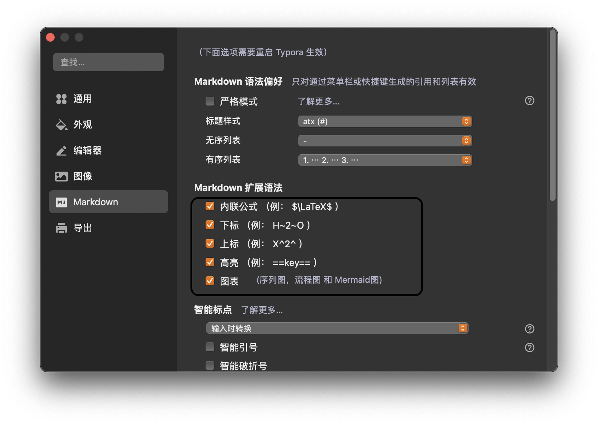

# MarkDown 基础

## 标题

# 一级标题用一个#

##二级标题用两个#

### 三级标题用三个#

#### 四级标题用四个#

##### 五级标题用五个#

###### 六级标题用六个#

## 文字

### 删除线

```markdown
删除线 ~~删除线~~ (使用波浪号)
```

~~删除线~~

### 斜体

```markdown
用 *斜体* 的文本
```

*斜体*

### 加粗

```markdown
**加粗**
```

**加粗**

### 下划线

```markdown
<u>下划线</u>   使用的mac操作系统而言的，其他系统可能会有其他的变化
原因：Markdown并没有虾滑下的原生语法，因为会和链接的默认样式产生混淆
```

<u>下划线</u>



Typora的偏好设置里面选择Markdown的扩展语法「尽量是全部勾选看个人需要」

### 高亮（需要勾选拓展语法）

```markdown
==斜体+加粗==
```

==斜体+加粗==

### 下标（需要勾选拓展语法）

```markdown
水 H~2~o
双氧水 H~2~o~2~
```

H~2~o

H~2~o~2~

###下标

```markdown
面积 m^2^
提及 m^3^
```

m^2^

m^3^

 ### 表情符号

 Emoji 支持表情符号，你可以用系统默认的 Emoji 符号。 也可以用图片的表情，输入 `:` 将会出现智能提示。  

#### 一些表情例子

```markdown
:smile: :laughing: :dizzy_face: :sob: :cold_sweat: :sweat_smile:  :cry: :triumph: :heart_eyes: :relaxed: :sunglasses: :weary:

:+1: :-1: :100: :clap: :bell: :gift: :question: :bomb: :heart: :coffee: :cyclone: :bow: :kiss: :pray: :sweat_drops: :hankey: :exclamation: :anger:

```

:smile: :laughing: :dizzy_face: :sob: :cold_sweat: :sweat_smile:  :cry: :triumph: :heart_eyes: :relaxed: :sunglasses: :weary: :+1: :-1: :100: :clap: :bell: :gift: :question: :bomb: :heart: :coffee: :cyclone: :bow: :kiss: :pray: :sweat_drops: :hankey: :exclamation: :anger:


### 表格

使用 `|` 来分隔不同的单元格，使用 `-` 来分隔表头和其他行：

```markdown
name | English Name
--- | ---
ZhengL | Luzzo
LinL| Cindy
```

> 为了使 Markdown 更清晰，`|` 和 `-` 两侧需要至少有一个空格（最左侧和最右侧的 `|` 外就不需要了）。

| name   | English Name |
| ------ | ------------ |
| ZhengL | Luzzo        |
| LinL   | Cindy        |

为了美观，可以使用空格对齐不同行的单元格，并在左右两侧都使用 `|` 来标记单元格边界，在表头下方的分隔线标记中加入 `:`，即可标记下方单元格内容的对齐方式：

```markdown
|    name       | price |
| :------------ | :---: |
| fried chicken | 19    |
| cola          |  32   |
```

| name          | price |
| :------------ | :---: |
| fried chicken |  19   |
| cola          |  32   |


、


